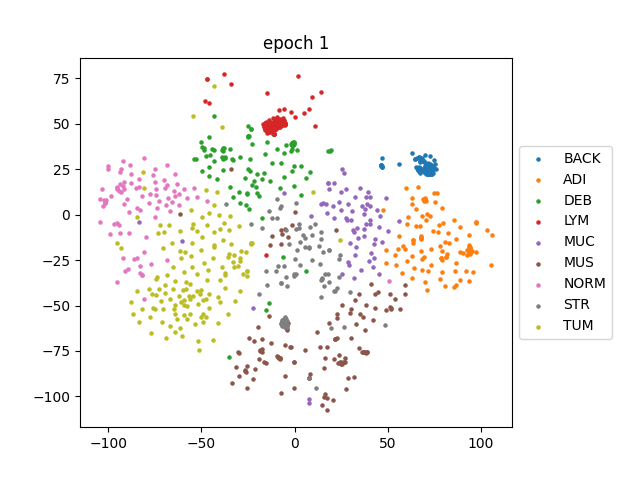

# FACILE: Enhancing Instance-Level Image Classification with Set-Level Labels

## Overview
"FACILE" introduces a novel approach to enhance instance-level image classification by utilizing set-level coarse-grained labels. This method significantly improves classification accuracy, particularly in histopathology image datasets, bridging the gap between instance-level and set-level image classification.

## Paper Details
- **Title:** Enhancing Instance-Level Image Classification with Set-Level Labels
- **Authors:** [Renyu Zhang](https://zhangrenyuuchicago.github.io/), [Aly A. Khan](https://people.cs.uchicago.edu/~aakhan/), [Yuxin Chen](https://yuxinchen.org/), [Robert L. Grossman](https://rgrossman.com/about.html)
- **Affiliation:** University of Chicago
- **Published:** [arXiv version](https://arxiv.org/pdf/2311.05659.pdf)

## Key Contributions
1. Introducing the FACILE algorithm, leveraging coarse-grained labels in the source domain to enhance model performance.
2. Theoretical analysis and experimental validation on natural and histopathology image datasets.

## Illustration


The GIF visualizes the progression of a linear layer trained using the FACILE method, appended to ViT-B/14 from [DINOv2](https://github.com/facebookresearch/dinov2). Over the course of 10 epochs, this layer is trained on the [TCGA](https://www.cancer.gov/ccg/research/genome-sequencing/tcga) dataset. After each epoch, we generate and visualize the representations on the [NCT-CRC-HE-100K](https://paperswithcode.com/dataset/nct-crc-he-100k) dataset using t-SNE. This visualization clearly shows how the representations evolve and improve with each training epoch, demonstrating the effectiveness of the FACILE approach in enhancing the quality and distinction of the learned feature representations.

## Repository Structure
- `/gen_tiles`: Source code of preprocessing WSIs from TCGA
- `/networks`: Source code for backbones and set-input models

## Citation
If you find this work useful, please consider citing:
``` citation
@misc{zhang2023enhancing,
      title={Enhancing Instance-Level Image Classification with Set-Level Labels}, 
      author={Renyu Zhang and Aly A. Khan and Yuxin Chen and Robert L. Grossman},
      year={2023},
      eprint={2311.05659},
      archivePrefix={arXiv},
      primaryClass={cs.LG}
}
